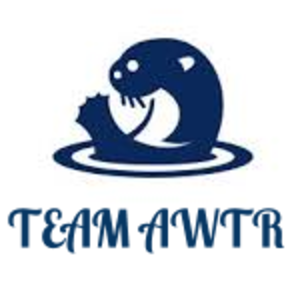

##TEAM AWTR

The purpose of this app is to allow users to link with their travel buddies so that they can plan joint events with minimal conflicts.  The user can enter their name and other information and even choose a colored otter to represent them.  The user can then set up groups and invite other people into their group.  They can then choose one or more events and have them loaded into a schedule of events.  Other members can then see all the events in one location and even modify them as they see fit.  This app allows many people to communicate with each other in a very efficient manner.  It allows them to maximize their vacation enjoyment by allowing them to cut down on the planning and bickering that usually accompanies planning group trips.

for DB team needs to
createdb awtr_library
knex migrate:latest
knex seed:run

##Team Logo:

##Catch phrase:  Link with your travel buddies.

##Team Members:
* President:  William
* Secretary:  Richard
* Judicial:   Tara
* Speaker:    Austin

##Project Name:
* Awtr — Asynchronous Web Timetable Resource

##Landing Page Concept:

##Project Description:
* We are creating an asynchronous app that will allow family members to log in and create groups to coordinate their activities through a shared timetable.  
* We are creating an app that will help groups decide on activities/schedule to partake in while traveling on vacation.
* Each user will be able to add, remove, and vote on activities.  Other users in the same group will be able to vote on all of groups stored activities.
* All users will be able to see the calendar of events.

##Who uses it?
* Primarily big groups of families and friends on a joint vacation.

##What outputs do they need?
* They will need to see each other's lists of preferred activities
* Map link of locations where the activities will be located

##What inputs are needed to generate those outputs?
* Input for sign-in
    * stretch oAuth for sign-in
* Group selections
    * email of group members, to be taken from user table
* Activities
* Timetable
* Preferences

##Technologies:
* Node
* Agile and CRUD
* AJAX
* Express
* GitHUB
* Mocha, Chai, Supertest
* Knex
* Handlebars
* Postgres
* HTML/CSS
* javaScript/jQuery
* ERD frameworks
* CRUD
* Firebase/Heroku deployment
* Google Geocode API
* Stretch --- oAuth

##Well Defined Feature List:
* As a user, when I visit the page, I will recognize it as AWTR because of its original branding.
* As a user, when I visit the landing page, then I will know what the site does.
* As a user, when I want to sign in, I want to be recognized by my user name.
* As a user, when I'm logged in, then I will see a list of groups that I belong to.
* As a user, when I'm within a group, I should see the group schedule.
* As a user, when I like one event out of a list, then I will be able to vote for it.
* As a group, when we have finished voting, then we should see the schedule with the chosen event.
* As a user, when I want to share something, then I should be able to enter some notes.
* As a group leader, when I create the group, then I will set the timeframe.
* STRETCHES
* As a user, when I log in, then I want to use my facebook account as authentication.
* As a group, when we are in a group, then no one outside our group should see our schedule.
* As a user, when I want to see where the event is, then I will use a maps link to see the location.
* As a user, when I'm logged on, then I want to see my avatar.
* As a user, when I make a group, then I want to be able to upload our family crest or vacation logo.
* As a user, when I put an event up for voting, then I can upload images to help sway the vote.
* As a user, when events have passed, then I want to be able to load photos from passed events.
